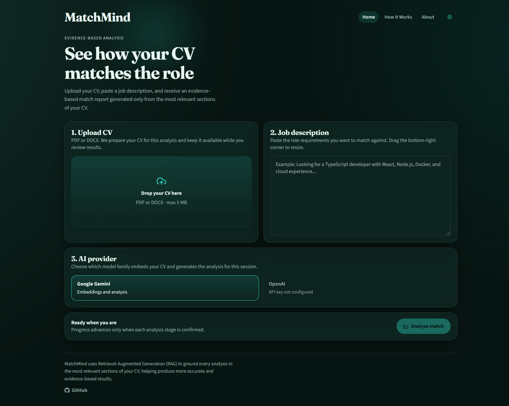
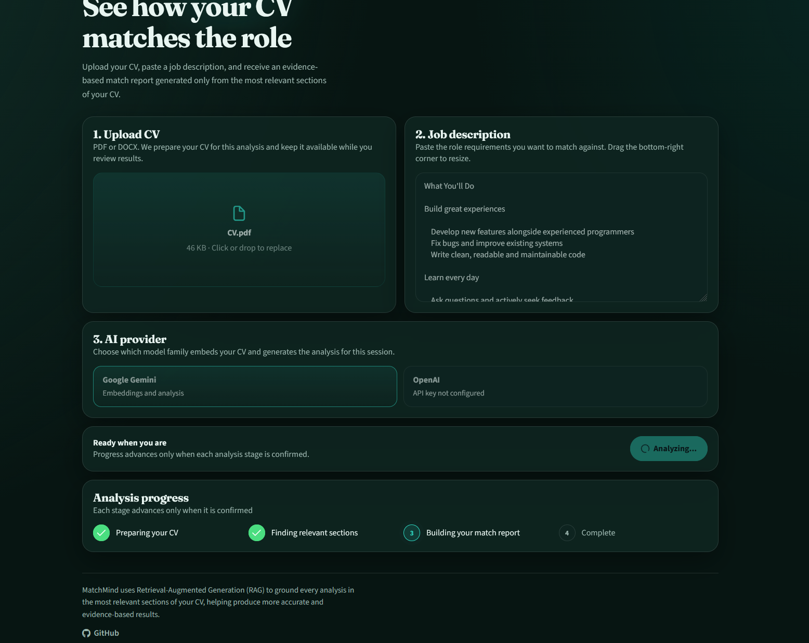
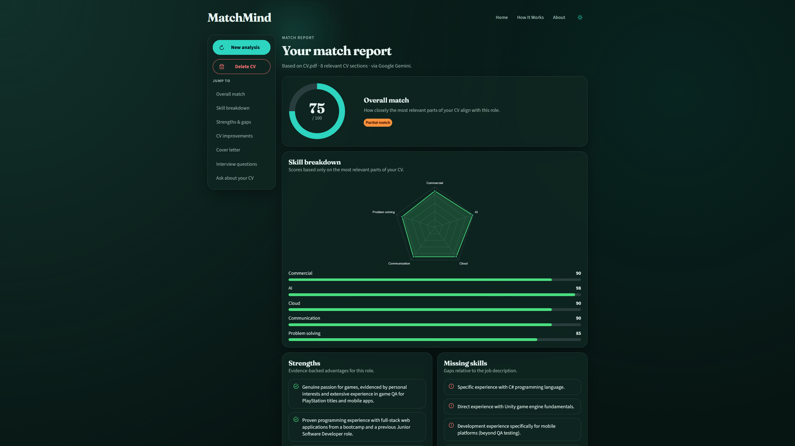
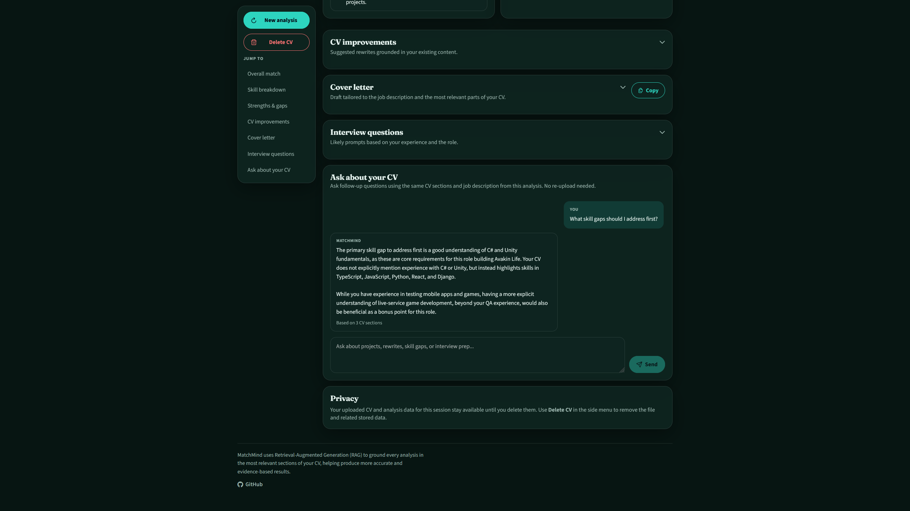
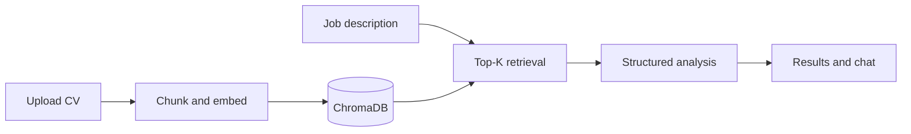

# MatchMind

AI-powered CV and job description analysis using Retrieval-Augmented Generation (RAG).

Upload your CV, paste a job description, and receive an evidence-based analysis including skill matching, CV improvements, a tailored cover letter, and interview preparation.



## Features

- Upload a PDF or DOCX CV and paste a job description
- Choose Google Gemini or OpenAI before analysis (embeddings and generation for that session)
- Evidence-based match score and skill breakdown from relevant CV sections only
- Strengths, missing skills, and suggested CV rewrites
- Tailored cover letter draft with copy support
- Interview questions with rationale, example answers, and common mistakes
- Follow-up chat that reuses the same CV session (no re-upload)
- Dark and light theme toggle
- Delete uploaded CV and related session data when you are done

## Demo

| Dashboard | Results | Chat |
|-----------|---------|------|
|  |  |  |

## How It Works

1. **Upload your CV.** The app prepares it for this analysis session.
2. **Paste a job description.** This is the role used for matching and chat follow-ups.
3. **Choose an AI provider.** Gemini or OpenAI embeds your CV and powers generation for that session.
4. **Retrieve the best-matching sections.** Instead of sending the full CV to the model, MatchMind finds the most relevant parts.
5. **Generate your report.** You get scores, gaps, rewrite ideas, a cover letter, and interview prep.
6. **Ask follow-up questions.** Chat reuses the same stored CV sections and job context.



The LLM never receives the full CV. Only Top-K retrieved chunks plus the job description are used for generation.

## Tech Stack

| Layer | Technologies |
|-------|--------------|
| Frontend | React, TypeScript, Vite, PrimeReact, Chart.js, React Router |
| Backend | Node.js, Express, TypeScript, pino |
| AI | Google Gemini (`@google/generative-ai`), OpenAI (`openai`) |
| Vector DB | ChromaDB |
| Document parsing | `pdf-parse`, `mammoth` |
| Shared contracts | Zod |
| Testing | Vitest, Supertest |
| Tooling | ESLint, Prettier, Docker Compose, Dev Containers |

## Architecture

```
MatchMind/
├── client/                 React frontend
│   └── src/
│       ├── components/     Upload, progress, results panels, nav, chat
│       ├── hooks/          Analysis and chat hooks
│       ├── pages/          Dashboard, results, How It Works, About
│       ├── services/       Typed API client (upload + SSE + chat)
│       └── theme/          Theme provider and global styles
├── server/                 Express API
│   ├── src/
│   │   ├── ai/
│   │   │   ├── providers/  Gemini and OpenAI implementations
│   │   │   └── prompts/    Analysis and chat prompt templates
│   │   ├── db/chroma/      Chroma client and collection helpers
│   │   ├── rag/
│   │   │   ├── chunking/   Section-aware text splitting
│   │   │   ├── ingestion/  PDF/DOCX parsing and ingest pipeline
│   │   │   └── retrieval/  Top-K semantic search
│   │   ├── services/       Session, analysis, and chat orchestration
│   │   ├── middleware/     Errors, upload limits, request validation
│   │   └── routes/         HTTP route definitions
│   └── test/               API integration tests
├── packages/shared/        Zod schemas and shared TypeScript types
├── docker/                 Multi-stage Dockerfiles and nginx config
└── .devcontainer/          Dev Container config
```

Shared Zod schemas in `packages/shared` keep API contracts consistent between frontend and backend.

## Running Locally

### Prerequisites

- [Docker Desktop](https://www.docker.com/products/docker-desktop/)
- At least one API key: [Gemini](https://aistudio.google.com/apikey) and/or [OpenAI](https://platform.openai.com/api-keys)

### Quick start

```bash
cp .env.example .env
# Set GEMINI_API_KEY and/or OPENAI_API_KEY in .env

docker compose up --build
```

Open [http://localhost:8080](http://localhost:8080).

Server health: [http://localhost:3001/api/health](http://localhost:3001/api/health)

### Local npm development

```bash
docker compose up chroma -d
npm install
npm run build --workspace=@matchmind/shared
npm run dev --workspace=@matchmind/server   # terminal 1
npm run dev --workspace=@matchmind/client   # terminal 2
```

Open [http://localhost:5173](http://localhost:5173). For npm runs, set `CHROMA_HOST=localhost` in `.env`. Docker Compose overrides this to `chroma` for the server container.

Useful commands: `npm test`, `npm run lint`, `docker compose down -v`.

## Environment Variables

| Variable | Required | Description |
|----------|----------|-------------|
| `GEMINI_API_KEY` | One of Gemini or OpenAI | Google Gemini API key |
| `OPENAI_API_KEY` | One of Gemini or OpenAI | OpenAI API key |
| `CHROMA_HOST` | No | ChromaDB host (`localhost` for npm, `chroma` in Docker Compose) |
| `CHROMA_PORT` | No | ChromaDB port (default: `8000`) |
| `PORT` | No | Server port (default: `3001`) |
| `RAG_TOP_K` | No | Top-K chunks for retrieval (default: `8`) |
| `MAX_UPLOAD_MB` | No | Max CV upload size in MB (default: `5`) |
| `GEMINI_GENERATION_MODEL` | No | Gemini generation model (default: `gemini-2.5-flash`) |
| `OPENAI_GENERATION_MODEL` | No | OpenAI generation model (default: `gpt-4o-mini`) |
| `OPENAI_EMBEDDING_MODEL` | No | OpenAI embedding model (default: `text-embedding-3-small`) |
| `CHAT_HISTORY_TURNS` | No | Max prior chat turns per request (default: `6`) |
| `AI_PROVIDER` | No | Default provider when none is selected (`gemini` or `openai`) |
| `LOG_LEVEL` | No | pino log level (default: `info`) |

## Roadmap

- Saved analysis history and multi-CV persistence
- Authentication and multi-user session ownership
- PDF export for match reports, cover letters, and interview packs
- ATS compatibility scoring and keyword coverage checks
- Additional AI providers beyond Gemini and OpenAI
- Side-by-side provider comparison for the same CV and job description

## License

MIT. See [LICENSE](LICENSE).
