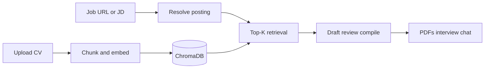

# MatchMind

AI-powered job application package builder using honest Top-K RAG.

Upload your CV, add a job posting URL or paste a job description, and get a tailored CV and cover letter (moderncv LaTeX to PDF), fit summary, company research when available, interview prep, and CV chat grounded in retrieved evidence only.


## Why I Built This

I wanted a local, evidence-first alternative to stuffing an entire CV into a chat model. MatchMind retrieves only the most relevant CV sections for a posting, then drafts and reviews application materials without inventing employers, skills, or metrics.

## Features

- Upload a PDF or DOCX CV
- Job posting URL (fetched safely) or pasted job description; a bare URL is never treated as JD prose
- Choose Google Gemini or OpenAI per session
- Honest fit summary (score, strengths, gaps) from retrieved CV chunks
- Optional company research via Tavily when configured
- Drafter and reviewer passes for tailored CV and cover letter content
- moderncv / Font Awesome PDF downloads (CV and cover letter) plus LaTeX sources zip
- Interview questions with rationale, example answers, and common mistakes
- Follow-up chat that reuses the same CV session and job context
- Dark and light theme toggle
- Delete uploaded CV and related session data when you are done

## Demo

| Home | Results | Chat |
|------|---------|------|
|  |  |  |

## How It Works

1. **Upload your CV.** MatchMind chunks and embeds it for this session.
2. **Add a job URL or paste the job description.** URLs are fetched as postings. URL-only text is never used as the job description itself.
3. **Choose an AI provider.** Gemini or OpenAI powers embeddings and generation for that session.
4. **Retrieve relevant sections.** Multi-query Top-K search pulls profile, experience, skills, education, and project evidence.
5. **Draft, research, review, and compile.** Fit summary, tailored CV/CL, optional company research, interview prep, then LaTeX PDFs via `lualatex`.
6. **Download and prepare.** Use PDF downloads, interview questions, and chat against the same evidence.



The LLM never receives the full CV. Only retrieved chunks plus the resolved job description drive generation.

## Tech Stack

| Layer | Technologies |
|-------|--------------|
| Frontend | React, TypeScript, Vite, PrimeReact, React Router |
| Backend | Node.js, Express, TypeScript, pino |
| AI | Google Gemini (`@google/generative-ai`), OpenAI (`openai`) |
| Vector DB | ChromaDB |
| Document parsing | `pdf-parse`, `mammoth` |
| PDF / LaTeX | TinyTeX, moderncv, Font Awesome, `lualatex`, poppler |
| Company research | Tavily (optional) |
| Shared contracts | Zod |
| Testing | Vitest, Supertest |
| Tooling | ESLint, Prettier, Docker Compose, Dev Containers |

## Architecture

```
MatchMind/
├── client/                 React frontend
│   └── src/
│       ├── components/     Upload, progress, results, chat, interview
│       ├── hooks/          Apply pipeline and chat hooks
│       ├── pages/          Home, results, How It Works, About
│       ├── services/       Typed API client (upload + SSE + chat)
│       └── theme/          Theme provider and global styles
├── server/                 Express API
│   ├── latex/              moderncv CV and cover letter templates
│   ├── src/
│   │   ├── ai/
│   │   │   ├── providers/  Gemini and OpenAI implementations
│   │   │   └── prompts/    Apply, fit, review, interview, chat
│   │   ├── db/chroma/      Chroma client and collection helpers
│   │   ├── rag/
│   │   │   ├── chunking/   Section-aware text splitting
│   │   │   ├── ingestion/  PDF/DOCX parsing and ingest pipeline
│   │   │   └── retrieval/  Multi-query Top-K search for Apply
│   │   ├── services/       Session, apply, job posting, LaTeX, chat
│   │   ├── middleware/     Errors, upload limits, request validation
│   │   └── routes/         HTTP route definitions
│   └── test/               Unit and API tests
├── packages/shared/        Zod schemas and shared TypeScript types
├── docker/                 Multi-stage Dockerfiles and nginx config
└── .devcontainer/          Dev Container config
```

Shared Zod schemas in `packages/shared` keep API contracts consistent between frontend and backend.

## Running Locally

### Prerequisites

- [Docker Desktop](https://www.docker.com/products/docker-desktop/)
- At least one API key: [Gemini](https://aistudio.google.com/apikey) and/or [OpenAI](https://platform.openai.com/api-keys)
- Optional: [Tavily](https://tavily.com) API key for company research

### Quick start

```bash
cp .env.example .env
# Set GEMINI_API_KEY and/or OPENAI_API_KEY in .env

docker compose up --build
```

Open [http://localhost:8080](http://localhost:8080).

Server health: [http://localhost:3001/api/health](http://localhost:3001/api/health)

### Local npm development

```bash
docker compose up chroma -d
npm install
npm run build --workspace=@matchmind/shared
npm run dev --workspace=@matchmind/server   # terminal 1
npm run dev --workspace=@matchmind/client   # terminal 2
```

Open [http://localhost:5173](http://localhost:5173). For npm runs, set `CHROMA_HOST=localhost` in `.env`. Docker Compose overrides this to `chroma` for the server container.

PDF compile in Docker uses TinyTeX with moderncv. Local npm PDF compile needs `lualatex` and the same packages if you want downloads outside Compose.

Useful commands: `npm test`, `npm run lint`, `docker compose down -v`.

## Scripts / Commands

| Command | Purpose |
|---------|---------|
| `docker compose up --build` | Full stack (client, server, Chroma) |
| `docker compose up chroma -d` | Chroma only for npm local dev |
| `npm run build --workspace=@matchmind/shared` | Build shared Zod package |
| `npm run dev --workspace=@matchmind/server` | API with `tsx` watch |
| `npm run dev --workspace=@matchmind/client` | Vite frontend |
| `npm test` | Server unit and integration tests |
| `npm run lint` | Lint workspaces |
| `docker compose down -v` | Stop stack and remove volumes |

## Environment Variables

| Variable | Required | Description |
|----------|----------|-------------|
| `GEMINI_API_KEY` | One of Gemini or OpenAI | Google Gemini API key |
| `OPENAI_API_KEY` | One of Gemini or OpenAI | OpenAI API key |
| `CHROMA_HOST` | No | ChromaDB host (`localhost` for npm, `chroma` in Docker Compose) |
| `CHROMA_PORT` | No | ChromaDB port (default: `8000`) |
| `PORT` | No | Server port (default: `3001`) |
| `RAG_TOP_K` | No | Top-K chunks per retrieval query (default: `8`) |
| `APPLY_MAX_CHUNKS` | No | Cap on chunks for the Apply pipeline (default: `20`) |
| `MAX_UPLOAD_MB` | No | Max CV upload size in MB (default: `5`) |
| `GEMINI_GENERATION_MODEL` | No | Gemini model ID (default: `gemini-2.5-flash`; use valid IDs such as `gemini-3.1-flash-lite` or `gemini-3-flash-preview`) |
| `OPENAI_GENERATION_MODEL` | No | OpenAI generation model (default: `gpt-4o-mini`) |
| `OPENAI_EMBEDDING_MODEL` | No | OpenAI embedding model (default: `text-embedding-3-small`) |
| `CHAT_HISTORY_TURNS` | No | Max prior chat turns per request (default: `6`) |
| `AI_PROVIDER` | No | Default provider when none is selected (`gemini` or `openai`) |
| `TAVILY_API_KEY` | No | Enables company research during Apply |
| `LOG_LEVEL` | No | pino log level (default: `info`) |

After changing `.env` for Docker, recreate the server container so Compose picks up new values.

## Future Improvements

- Saved application history and multi-CV persistence
- Authentication and multi-user session ownership
- Additional AI providers beyond Gemini and OpenAI
- Side-by-side provider comparison for the same CV and job

## License

MIT. See [LICENSE](LICENSE).
